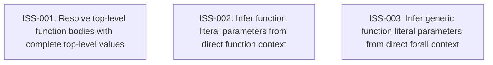

# Markdown Issue Index

Generated by derive-tracker.wasm

## Ready Queue

| ID | Priority | Type | Assignee | Title | Labels |
| --- | ---: | --- | --- | --- | --- |
| [ISS-001](ISS-001.md) | 1 | bug | unassigned | Resolve top-level function bodies with complete top-level values | area/resolution, spec-examples, implementation-discrepancy |
| [ISS-002](ISS-002.md) | 1 | bug | unassigned | Infer function literal parameters from direct function context | area/typecheck, lti, spec-examples, implementation-discrepancy |
| [ISS-003](ISS-003.md) | 1 | bug | unassigned | Infer generic function literal parameters from direct forall context | area/typecheck, lti, generics, spec-examples, implementation-discrepancy |

## Unresolved Issues

| ID | Status | Priority | Type | Assignee | Blocked by | Blocks | Title |
| --- | --- | ---: | --- | --- | --- | --- | --- |
| [ISS-001](ISS-001.md) | open | 1 | bug | unassigned | none | none | Resolve top-level function bodies with complete top-level values |
| [ISS-002](ISS-002.md) | open | 1 | bug | unassigned | none | none | Infer function literal parameters from direct function context |
| [ISS-003](ISS-003.md) | open | 1 | bug | unassigned | none | none | Infer generic function literal parameters from direct forall context |

## Dependency Graph

## Warnings

None.

