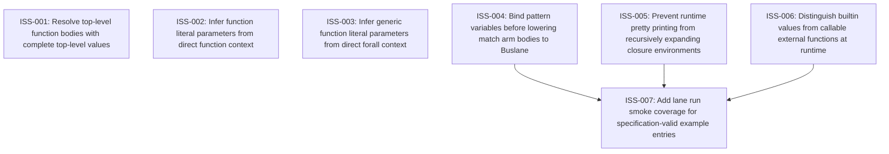

# Markdown Issue Index

Generated by derive-tracker.wasm

## Ready Queue

| ID | Priority | Type | Assignee | Title | Labels |
| --- | ---: | --- | --- | --- | --- |
| [ISS-004](ISS-004.md) | 1 | bug | unassigned | Bind pattern variables before lowering match arm bodies to Buslane | area/elaborate, area/buslane, pattern-matching, spec-examples, runtime |
| [ISS-005](ISS-005.md) | 1 | bug | unassigned | Prevent runtime pretty printing from recursively expanding closure environments | area/buslane-interpreter, pretty, runtime, lane-run, spec-examples |
| [ISS-006](ISS-006.md) | 1 | bug | unassigned | Distinguish builtin values from callable external functions at runtime | area/builtins, area/buslane-interpreter, runtime, lane-run, spec-examples |

## Unresolved Issues

| ID | Status | Priority | Type | Assignee | Blocked by | Blocks | Title |
| --- | --- | ---: | --- | --- | --- | --- | --- |
| [ISS-004](ISS-004.md) | open | 1 | bug | unassigned | none | ISS-007 | Bind pattern variables before lowering match arm bodies to Buslane |
| [ISS-005](ISS-005.md) | open | 1 | bug | unassigned | none | ISS-007 | Prevent runtime pretty printing from recursively expanding closure environments |
| [ISS-006](ISS-006.md) | open | 1 | bug | unassigned | none | ISS-007 | Distinguish builtin values from callable external functions at runtime |
| [ISS-007](ISS-007.md) | open | 2 | task | unassigned | ISS-004, ISS-005, ISS-006 | none | Add lane run smoke coverage for specification-valid example entries |

## Dependency Graph

## Warnings

None.

